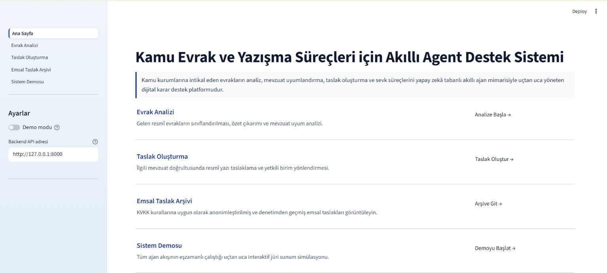
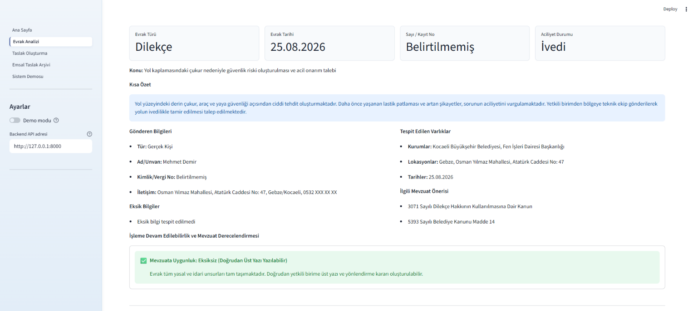
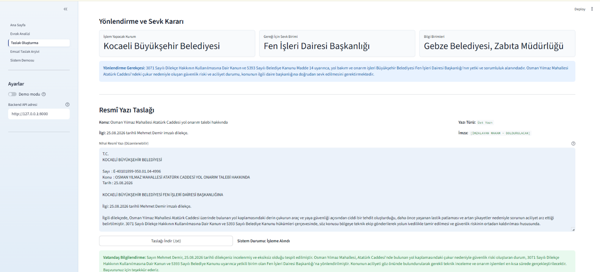
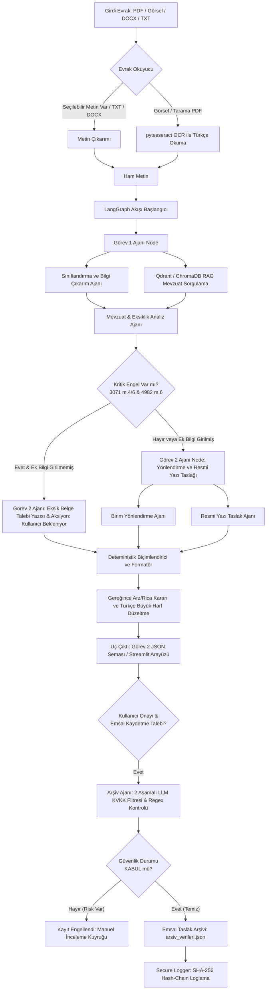

# NEMA: Kamu Evrak ve Resmi Yazışma Yapay Zeka Destek Sistemi

*Kamu kurumları için mevzuat uyumlu, çoklu ajan (multi-agent) destekli akıllı evrak sınıflandırma, RAG tabanlı mevzuat analizi ve resmî yazı taslaklama çözümü.*

---

[](#)
[](#)
[](#)
[](#)
[](#)
[](#)
[](LICENSE)

---

## 1. Proje Özeti
**NEMA**, kamu kurum ve kuruluşlarının evrak yönetim süreçlerini otomatikleştiren ve karar destek süreçlerini güçlendiren yapay zeka tabanlı bir akıllı asistan sistemidir. LangGraph tabanlı durum makinesi mimarisiyle çalışan sistem; dilekçe ve resmî yazıları analiz eder, mevzuata uygunluk denetimi yapar, hiyerarşik kurallara uygun taslak cevap yazısı hazırlar ve verileri KVKK maskelemesinden geçirerek emsal arşivinde saklar.

---

## 2. İçindekiler
- [1. Proje Özeti](#1-proje-özeti)
- [2. İçindekiler](#2-içindekiler)
- [3. Problem Tanımı](#3-problem-tanımı)
- [4. Çözüm / Ne Yapıyor](#4-çözüm--ne-yapıyor)
- [5. Öne Çıkan Özellikler](#5-öne-çıkan-özellikler)
- [Ekran Görüntüleri / Demo](#ekran-görüntüleri--demo)
- [6. Mimari / Nasıl Çalışıyor (Kısa Teknik Genel Bakış)](#6-mimari--nasıl-çalışıyor-kısa-teknik-genel-bakış)
- [7. Kurulum Talimatları (Installation)](#7-kurulum-talimatları-installation)
- [8. Kullanım (Usage)](#8-kullanım-usage)
- [9. Klasör/Dosya Yapısı](#9-klasördosya-yapısı)
- [10. Yol Haritası / Gelecek Planları (Roadmap)](#10-yol-haritası--gelecek-planları-roadmap)
- [11. Katkıda Bulunma (Contributing)](#11-katkıda-bulunma-contributing)
- [12. Lisans](#12-lisans)
- [13. İletişim / Ekip](#13-iletişim--ekip)

---

## 3. Problem Tanımı
Kamu kurum ve kuruluşları (belediyeler, üniversiteler, bakanlıklar vb.) her gün vatandaşlardan ve diğer kurumlardan çok sayıda fiziki veya dijital başvuru, dilekçe ve resmi yazı almaktadır. Bu evrakların;
* Manuel olarak okunup tasnif edilmesi,
* İlgili mevzuatlara (örneğin 3071 Sayılı Dilekçe Hakkı Kanunu, 4982 Sayılı Bilgi Edinme Hakkı Kanunu) uygunluğunun denetlenmesi,
* Dilekçe sahibinin bilgilerinin, kimlik/vergi numaralarının ve iletişim kanallarının doğrulanması,
* Doğru alt birimlere/müdürlüklere (örn. Fen İşleri, Veteriner İşleri) yönlendirilmesi,
* Resmi yazışma kurallarına (Resmî Yazışmalarda Uygulanacak Usul ve Esaslar Hakkında Yönetmelik) uygun cevap veya eksik bilgi talep taslaklarının hazırlanması;
ciddi oranda zaman kaybına, insan hatasına ve yasal yanıt sürelerinin aşılması riskine yol açmaktadır.

---

## 4. Çözüm / Ne Yapıyor
**NEMA**, kamu kurumlarının evrak yönetim süreçlerini uçtan uca otomatikleştiren yapay zeka tabanlı bir karar destek ve otomasyon sistemidir. Gelişmiş dil modellerini (LLM) **LangGraph** tabanlı bir State Machine (Durum Makinesi) mimarisi ile yöneterek evrakları üç ana aşamada işler:

* **Görev 1: Evrak Analizi & Mevzuat Denetimi:** Evraktan gönderici bilgisi (ad, soyad, unvan, TCKN/VKN), evrak tarihi, konusu ve önemli bilgi unsurlarını çıkarır. Qdrant ve ChromaDB tabanlı RAG (Retrieval-Augmented Generation) mekanizmasını kullanarak ilgili mevzuatı tespit eder ve 3071 ile 4982 sayılı kanunlar çerçevesinde eksik bilgi (örn. isim veya imza eksikliği) kontrolü yapar.
* **Görev 2: Birim Yönlendirme & Resmî Yazı Taslaklama:** Görev 1 analiz sonuçlarına dayanarak evrakın sevk edileceği asıl kurum ve alt birimi belirler (yönlendirme gerekçesiyle birlikte). Mevzuata aykırı bir engel bulunmuyorsa (veya kullanıcı eksiklikleri ek bilgiyle tamamladıysa), resmi yazışma standartlarına (İlgi, Konu, Alıcı Makam Bloğu, Gövde Metni, Hiyerarşik Arz/Rica durumu ve İmza Makamı) uygun resmî yazı veya eksik bilgi talep yazısı taslaklarını saniyeler içinde üretir.
* **Emsal Karar Arşivi & KVKK Güvenlik Denetimi:** Onaylanan ve kesinleşen cevap taslaklarını, çift katmanlı LLM (maskeleme ve bağımsız denetim) ve Regex kontrolünden oluşan KVKK filtresinden geçirerek anonimleştirir. Temizlenen belgeleri emsal arşivine kaydeder ve tüm erişim/işlem loglarını kriptografik olarak hash-chain (blockchain mantığı) yapısında saklar.

---

## 5. Öne Çıkan Özellikler
* **Hibrit Metin Çıkarımı (OCR Entegrasyonu):** PDF formatındaki evraklardan doğrudan metin çıkarır; taranmış veya görsel formatındaki PDF/resim belgeleri ile Word (DOCX) ve metin (TXT) belgeleri için `Tesseract OCR`, `pdf2image`, `python-docx` ve `Pillow` kütüphanelerini kullanarak otomatik Türkçe karakter destekli metin okuma gerçekleştirir.
* **LangGraph ile Ajan Akış Yönetimi (State Machine):** Ajanlar arası iş birliğini koordine eden durum tabanlı iş akışı mimarisi. Görev 1 ajanı, mevzuat ajanı, yönlendirme ajanı ve kullanıcı iletişim ajanı birbiriyle uyumlu çalışır.
* **Akıllı RAG (Retrieval-Augmented Generation) Sistemi:** `EVREN LLM API` (bge-m3-embed) ile entegre, mevzuat maddelerini Qdrant ve ChromaDB vektör veritabanlarında saklayan ve semantik olarak en yakın kanun maddelerini getiren akıllı arama sistemi.
* **Mevzuat Uygunluk Bariyeri:** Dilekçe Hakkı Kanunu (3071) ve Bilgi Edinme Hakkı Kanunu (4982) gereğince isim, imza veya talep gibi kritik/engelleyici eksiklerin tespiti halinde resmi yazışma sürecini askıya alma ve otomatik "Eksik Bilgi Talep Yazısı" taslaklama yeteneği.
* **Hassas Arz/Rica Kontrolü:** Resmi yazışma kurallarına göre, gönderilen ve alıcı kurum arasındaki hiyerarşiyi otomatik algılayarak "arz ederim", "rica ederim" veya "bilgilerinize arz ederim" ifadelerini deterministik olarak seçer ve yerleştirir.
* **Türkçe Karakter Normalizasyonu:** Resmi yazı taslaklarının tamamen Türkçe yazım kurallarına ve resmî yazışma esaslarına (büyük harfle İ/I dönüşümleri vb.) uygun olarak biçimlendirilmesi.
* **Çift Katmanlı KVKK Anonimleştirme (Arşiv Ajanı):** Arşive eklenecek taslak metinlerdeki vatandaş verilerini (ad, soyad, TCKN, adres, telefon, e-posta, hastalık/sağlık verileri vb.) `llm-large` (1. Katman Maskeleme), `llm-fast` (2. Katman Bağımsız Denetçi) ve deterministic Regex bariyerleriyle temizleyen üst düzey güvenlik mekanizması. Kurumsal ve idari metadata başlıklarını (Sayı, Tarih) korur.
* **Blok Zinciri Mantıklı Güvenli Denetim Logu (Secure Logger):** Hassas evrak görüntüleme, onaylama ve arşivleme işlemlerini, her kaydı bir öncekinin SHA-256 hash'iyle sarmalayan kriptografik bir hash-chain (blockchain mantığı) yapısında saklar. Geriye dönük manipülasyonu ve log silinmesini engeller.
* **Emsal Karar Arşivi Arama Modülü:** KVKK temizliğinden geçmiş anonim emsal taslakların saklandığı, Streamlit arayüzünde hızlı arama barı, filtreleme ve detaylı denetim raporu görüntüleme özellikleriyle donatılmış kurumsal bellek/arşiv arayüzü.

---

## Ekran Görüntüleri / Demo

Sistem arayüzünden örnek ekran görüntüleri aşağıda listelenmiştir (görseller eklenecektir):

| Ana Sayfa | Evrak Analizi |
| :---: | :---: |
|  |  |

| Taslak Oluşturma | Emsal Arşivi |
| :---: | :---: |
|  |  |

---

## 6. Mimari / Nasıl Çalışıyor (Kısa Teknik Genel Bakış)

Aşağıdaki diyagramda sistemin iş akışı ve LangGraph ajanlarının veri akış şeması görülmektedir:



**Kullanılan Teknolojiler ve Tercih Gerekçeleri:**
* **Python & FastAPI:** Hızlı, yüksek performanslı ve Pydantic veri şemalarıyla doğrudan entegre asenkron backend mimarisi.
* **LangGraph:** Çoklu ajanların durum yönetimini (state management) döngüsel (cyclic) veya koşullu (conditional) graflarla esnekçe yönetebilmek için tercih edilmiştir.
* **Qdrant & ChromaDB:** RAG aramalarında yüksek hızlı benzerlik aramaları (Cosine distance) ve metadata filtreleme desteği sağlaması nedeniyle kullanılmıştır.
* **EVREN LLM API:** Yarışma standartlarına uygun, Türkçe dil hassasiyeti yüksek `llm-large` (maskeleme için), `llm-fast` (güvenlik denetimi ve genel ajan kararları için) ve `bge-m3-embed` gömme (embedding) modellerini kullanmak için entegre edilmiştir.
* **Çift Ajanlı KVKK Filtreleme:** Kişisel verilerin korunması kanununa tam uyum sağlamak adına, maskeleme yapan `llm-large` modeli ile sızıntıları bağımsız olarak inceleyen `llm-fast` modeli çift katmanlı denetim mekanizması oluşturacak şekilde tasarlanmıştır.
* **Blockchain-Style Append-Only Logging (SecureAuditLogger):** Kamu evraklarında hassas verilere kimin hangi amaçla ulaştığını izlemek amacıyla, geriye dönük log tahrifatını kriptografik olarak engelleyen SHA-256 hash zinciri tabanlı append-only loglama tercih edilmiştir.

---

## 7. Kurulum Talimatları (Installation)

### Gereksinimler
* Python 3.10 veya üzeri
* Tesseract OCR (Sistem düzeyinde kurulmalıdır)
* Poppler Utils (pdf2image kütüphanesi için gereklidir)

#### Sistem Bağımlılıklarının Kurulumu (Linux/Ubuntu)
```bash
sudo apt-get update
sudo apt-get install tesseract-ocr tesseract-ocr-tur poppler-utils -y
```

#### Sistem Bağımlılıklarının Kurulumu (Windows)
1. [Tesseract OCR Windows Installer](https://github.com/UB-Mannheim/tesseract/wiki) indirip kurun ve kurulum dizinini (Örn: `C:\Program Files\Tesseract-OCR`) ortam değişkenlerinize (Path) ekleyin.
2. [Poppler for Windows](https://github.com/oschwartz10612/poppler-windows/releases) indirip binary dizinini (bin) Path'e ekleyin.

### Adım Adım Kurulum

1. Repoyu bilgisayarınıza indirin:
   ```bash
   git clone https://github.com/efsayilmaz/nema.git
   cd nema
   ```

2. Sanal ortam (virtual environment) oluşturup aktif edin:
   ```bash
   python -m venv .venv
   
   # Windows için (PowerShell):
   .\.venv\Scripts\Activate.ps1
   
   # Linux/macOS için:
   source .venv/bin/activate
   ```

3. Gerekli kütüphaneleri yükleyin:
   ```bash
   pip install -r requirements.txt
   ```
   > **Not:** Kod tabanında agent akışı ve yerel RAG yedekleme süreçlerinde kullanılan `langgraph` ve `chromadb` paketleri, `requirements.txt` içinde tanımlı değilse manuel olarak yüklenebilir:
   > ```bash
   > pip install langgraph chromadb
   > ```

4. Ortam değişkenlerini ayarlayın. Proje ana dizininde bir `.env` dosyası oluşturun ve aşağıdaki bilgileri girin:
   ```env
   EVREN_API_KEY=your_evren_llm_api_key
   QDRANT_API_KEY=your_qdrant_db_api_key
   QDRANT_URL=https://your-qdrant-instance.example.com/
   ```

#### Çevre Değişkenleri Açıklamaları

| Değişken | Açıklama |
| :--- | :--- |
| `EVREN_API_KEY` | Evren LLM API servislerine erişim sağlamak için kullanılan kimlik doğrulama anahtarı. |
| `QDRANT_API_KEY` | Vektör veritabanı Qdrant API servislerine bağlanmak için kullanılan yetkilendirme anahtarı. |
| `QDRANT_URL` | Mevzuat RAG sorgularının yapılacağı Qdrant sunucusunun bağlantı URL'i (örn. `https://your-qdrant-instance.example.com/`). |

---

## 8. Kullanım (Usage)

### RAG Mevzuat Veritabanını İlklendirmek
Vektör veritabanını test mevzuat maddeleriyle doldurmak için bir kereye mahsus `rag.py` dosyasını çalıştırabilirsiniz:
```bash
python rag.py
```

### 1. API Servisini Çalıştırma (FastAPI Backend)
Streamlit arayüzünün analiz ve yazı taslaklama yapabilmesi için backend sunucusunun çalıştırılması gerekmektedir. Sunucuyu yerel ortamda 8000 portunda ayağa kaldırmak için aşağıdaki uvicorn komutunu çalıştırın:

```bash
uvicorn main_api:app --host 127.0.0.1 --port 8000 --reload
```
API dökümantasyonuna ve etkileşimli API test arayüzüne tarayıcınızdan `http://127.0.0.1:8000/docs` adresinden erişebilirsiniz.

#### Entegrasyon ve API Uç Noktaları (Endpoints)

* **GET `/health`**: Backend API servisinin ayakta ve sağlıklı olup olmadığını kontrol eder.
* **POST `/analiz`**: PDF evrak yükleyerek analiz başlatır.
  * **Girdi**: Multipart Form Data (`dosya`: PDF dosyası)
  * **Yanıt**: Görev 1 şemasını ve ayıklanan ham metni döner.
* **POST `/api/v1/gorev1`**: Gönderilen metne Görev 1 analizini uygular ve mevzuat/eksiklik bilgilerini çıkarır.
  * **Girdi**: `{"ham_metin": "..."}`
* **POST `/api/v1/gorev2`**: Görev 1 analiz çıktısını alarak birim yönlendirme kararını ve resmi yazı taslağını hazırlar.
  * **Girdi**: `{"gorev1_ciktisi": {...}, "ek_bilgi": "..."}`
* **POST `/api/v1/evrak-isle`**: Gönderilen ham metni alarak sırasıyla Görev 1 ve Görev 2 ajanlarını LangGraph akışı üzerinden tetikler.
  * **Girdi**:
    ```json
    {
      "ham_metin": "14.11.2025 tarihinde üniversiteniz bilgisayar mühendisliği bölümü vize sınavına girdim. Maddi hata olduğunu düşünüyorum...",
      "gorev1_ciktisi": null,
      "ek_bilgi": null
    }
    ```

---

### 2. Streamlit Arayüzünü Çalıştırma (Frontend UI)
Kullanıcı dostu web arayüzünü çalıştırmak için:
```bash
cd teknofest_agent_app
pip install -r requirements.txt
streamlit run app.py
```
Arayüz varsayılan olarak yerel ortamdaki `http://127.0.0.1:8000` backend API adresine bağlanacak şekilde yapılandırılmıştır. Arayüzün sol menüsünden (Sidebar) "Demo modu" kapatılarak doğrudan canlı backend API adresi (`http://127.0.0.1:8000`) kullanılabilir.

---

### Testleri Çalıştırma

Proje kapsamındaki birim (unit) ve entegrasyon testlerini çalıştırmak için `pytest` modülünü kullanabilirsiniz:

```bash
# Tüm testleri çalıştırmak için
pytest tests/

# Test kapsama (coverage) oranını görmek ve raporlamak için
pip install pytest-cov
pytest --cov=. tests/
```

---

## 9. Klasör/Dosya Yapısı

```text
nema/
│
├── chroma_db/               # Yerel ChromaDB yedek veritabanı dosyaları
├── arsiv_verileri.json      # Arşivlenen emsal taslak verilerini tutan yerel JSON veritabanı
├── gorev1/                  # Görev 1 (Sınıflandırma, Analiz, Mevzuat) Ajanı Modülü
│   ├── agent.py             # Görev 1 Koordinatör Ajanı
│   ├── mevzuat_ajani.py     # Kanun ve mevzuat uygunluk denetleyicisi
│   ├── ozetleme_ajani.py    # Evrak özetleme ve niyet çıkarım ajanı
│   ├── schemas.py           # Pydantic veri şemaları (Gorev1CiktiSemasi)
│   └── siniflandirma_ajani.py # Evrak türü, gönderen ve varlık çıkarım ajanı
│
├── gorev2/                  # Görev 2 (Yönlendirme ve Taslak Hazırlama) Ajanı Modülü
│   ├── agent.py             # Görev 2 Koordinatör Ajanı
│   ├── arsiv_ajani.py       # KVKK Maskeleme, LLM Denetçisi ve Regex güvenlik bariyerini yöneten Arşiv Ajanı
│   ├── kullanici_iletisim_ajani.py # Eksik bilgi tespiti ve kullanıcı bilgilendirme kanalı
│   ├── schemas.py           # Pydantic veri şemaları (Gorev2CiktiSemasi)
│   └── yonlendirme_taslak_ajani.py # Birim yönlendirici, hiyerarşik arz/rica düzenleyici ve taslak oluşturucu
│
├── teknofest_agent_app/     # Streamlit Web Arayüzü (Frontend)
│   ├── app.py               # Arayüz Ana Sayfası ve Başlatıcı
│   ├── arsiv_verileri.json  # Streamlit uygulamasının okuduğu emsal arşiv veritabanı
│   ├── pages/               # Arayüz Çoklu Sayfa Yapısı
│   │   ├── 1_Gorev_1_Siniflandirma.py
│   │   ├── 2_Gorev_2_Taslak_Yonlendirme.py
│   │   └── 3_Demo_Uctan_Uca.py
│   ├── utils/               # Backend API bağlantı modülleri, Mock Veriler ve Güvenlik Araçları
│   │   ├── arsiv_db.py      # Arşiv verilerini okuma/yazma yardımcı modülü
│   │   ├── secure_logger.py # Blok zinciri mantıklı, SHA-256 hash zincirli kriptografik loglama (Secure Logger)
│   │   ├── backend_client.py
│   │   └── sample_data.py
│   └── views/               # Arayüz Görünümleri
│       ├── 0_Ana_Sayfa.py
│       ├── 1_Evrak_Analizi.py
│       ├── 2_Taslak_Olusturma.py
│       ├── arsiv.py         # Emsal Taslak Arşivi arama ve listeleme sayfası
│       └── 3_Sistem_Demosu.py
│
├── tests/                   # Otomatik Birim (Unit) ve Benchmark Testleri
│   ├── benchmark_gorev2.py
│   ├── test_belge_isleme.py
│   ├── test_env_loading.py
│   ├── test_gorev1_benchmark.py
│   ├── test_gorev2.py
│   └── test_gorev2_mock.py
│
├── .env.example             # Örnek Çevre Değişkenleri Şablonu
├── batch_main.py            # Toplu veri seti işleme betiği (CLI)
├── belge_isleme.py          # PDF'ten metin çıkarma ve OCR normalleştirme araçları
├── evrak_okuyucu.py         # Resim/PDF/DOCX/TXT formatlarından esnek veri okuyucu
├── evren_client.py          # EVREN LLM API istemcisi ve model doğrulama katmanı
├── langgraph_akis.py        # LangGraph State Machine (Durum Makinesi) graf tanımları
├── main.py                  # FastAPI sunucusu (Alternatif giriş noktası)
├── main_api.py              # FastAPI Ana Sunucusu ve CORS Ayarları (Esas backend)
├── rag.py                   # Qdrant & ChromaDB Mevzuat RAG Veritabanı ve Arama Mantığı
├── requirements.txt         # Proje Bağımlılıkları
├── pyproject.toml           # Pyright ve Ruff araç yapılandırmaları
├── pytest.ini               # Pytest yapılandırması
├── test_anonimlestirme.py   # KVKK maskeleme ve hibrit anonimleştirme mekanizması testleri
└── LICENSE                  # Apache 2.0 Lisans Metni
```

---

## 10. Yol Haritası / Gelecek Planları (Roadmap)
- [ ] **Çoklu Sayfa/Çoklu Belge OCR Desteği:** Çok sayfalı ve taranmış karmaşık resmi belgelerde doğruluk oranını artırmak için LayoutLM tabanlı sayfa analizi eklenmesi.
- [ ] **Otomatik Islak İmza Doğrulama:** Görüntü işleme modelleri (YOLO/OpenCV) yardımıyla belgedeki ıslak imzaların varlığını ve geçerliliğini görsel olarak tespit etme.
- [ ] **E-İmza Entegrasyonu:** Taslaklanan resmi yazışmaların e-imza ile imzalanarak doğrudan EBYS (Elektronik Belge Yönetim Sistemi) standartlarına (UETS, KEP) aktarılması.
- [ ] **Ek Mevzuat Kütüphanesi:** RAG sisteminin kapsamını genişleterek İdari Yargılama Usulü Kanunu (İYUK) ve Belediye Kanunu alt yönetmeliklerinin tamamını kapsama alma.

---

## 11. Katkıda Bulunma (Contributing)

> [!IMPORTANT]
> Bu proje bir **TEKNOFEST** yarışma projesidir. Yarışma değerlendirme ve geliştirme süreci devam ederken projenin ana kod tabanı dış katkılara geçici olarak kapalı tutulmaktadır.

Yine de projeyi incelemek, yerelinizde test etmek veya yarışma sonrasındaki süreç için katkı hazırlamak isterseniz:

1. Bu projeyi fork edin (`https://github.com/efsayilmaz/nema/fork`).
2. Yeni bir özellik dalı (feature branch) oluşturun: `git checkout -b feature/yeni-ozellik`.
3. Değişikliklerinizi commit edin: `git commit -am 'Ekle: Yeni Özellik'`.
4. Dalınızı push edin: `git push origin feature/yeni-ozellik`.
5. Bir Pull Request açarak incelemeye gönderin.

---

## 12. Lisans
Bu proje [Apache License 2.0](LICENSE) altında lisanslanmıştır. Daha fazla bilgi için `LICENSE` dosyasını inceleyebilirsiniz.

---

## 13. İletişim / Ekip
* **Proje Sahibi / Geliştirici:** Efsa Yılmaz - Merve Uçan - Asude Nur Karaavcı - Nazlı Kul
* **Takım Adı:** Nema 
* **Proje Bağlantısı:** [https://github.com/efsayilmaz/nema](https://github.com/efsayilmaz/nema)
